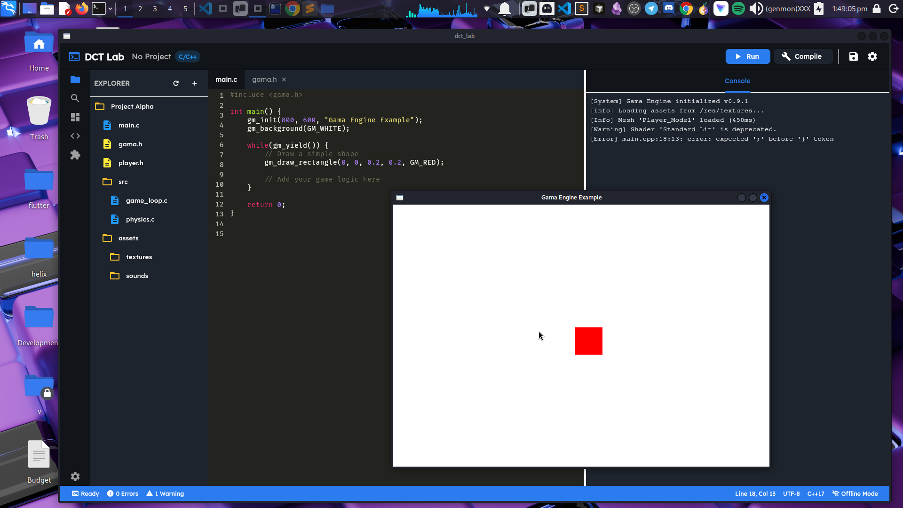
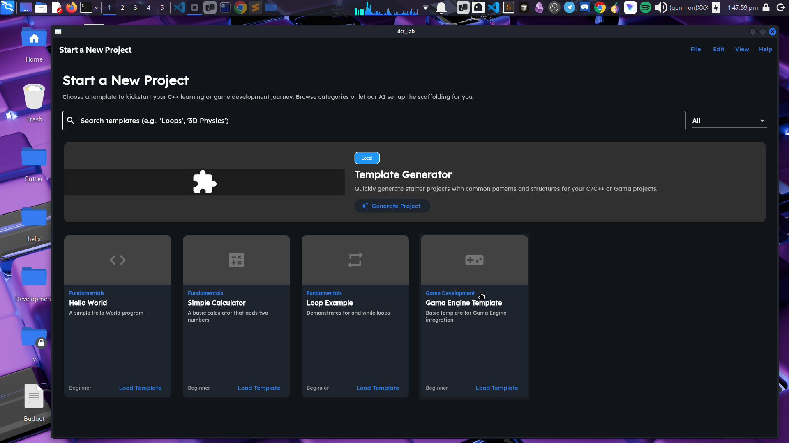

# DCT Lab - C/C++ & Gama Engine IDE



DCT Lab is a comprehensive, offline-first Integrated Development Environment (IDE) designed for C/C++ and Gama Engine game development. It provides a unified platform where developers can write, compile, and run both general C/C++ programs and specialized Gama Engine games with real-time graphics rendering.



**Website:** https://gama.rbs.cm
**Documentation:** https://gama.rbs.cm/docs

Gama project aims to provide a convenient way for students and beginners in
C, to ship portable and safe 2D games, putting emphasis on simplicity, safety
and control.

## Features

### DCT Lab IDE Features
- **Offline-First**: No internet connection or user accounts required
- **Modern UI**: Dark-themed interface with intuitive navigation
- **Project Management**: Organize your code in projects with functional file explorer
- **Code Templates**: Pre-built templates for common C/C++ and Gama patterns
- **Syntax Highlighting**: For C/C++ and Gama-specific code
- **Integrated Compiler**: Built-in compilation and execution for C/C++ and Gama projects
- **Resizable Panels**: Customize your workspace with adjustable editor and console panels
- **Dual Support**: Handles both standard C/C++ projects and Gama Engine game development
- **Visual Code Editor**: With syntax highlighting and project management
- **Real-time Graphics**: Gama Engine projects render directly in separate windows
- **Interactive UI**: With resizable panels and intuitive navigation
- **Functional File Explorer**: Click on files to load corresponding code templates
- **Navigation Bar**: Switch between different screens (Templates, Editor, etc.)

### Gama Engine Features
- **Lightweight C Library**: Simple, easy-to-learn C API with clear function names designed specifically for students and beginners.
- **Built-in 2D Physics Engine**: Physics system with bodies, shapes, and collision detection supporting restitution, friction, and constraints.
- **Immediate Mode Rendering**: Draw shapes directly without creating objects. Reduces pointer usage and manual memory management.
- **Comprehensive Animation System**: Multiple easing functions and wave animations for smooth, professional-looking motion.
- **Modern CLI Tool**: Fast project manager written in V with zero-dependency setup using embedded TCC compiler.
- **Advanced Input System**: Intuitive key and mouse input with predefined shortcuts for arrows, space, and mouse buttons.
- **Cross-Platform Development**: Target Windows, Linux, and Web with consistent APIs and behavior.
- **Educational Focus**: Designed specifically for teaching C programming with safety and simplicity in mind.

## Getting Started with DCT Lab IDE

1. Clone this repository
2. Navigate to the `dct_lab` directory
3. Install Flutter dependencies with `flutter pub get`
4. Run the IDE with `flutter run -d linux` (or your target platform)

## Using DCT Lab IDE

### Creating a New Project
1. Open the IDE and select a template from the Templates screen
2. Choose between C/C++ templates or Gama Engine templates
3. The IDE will automatically configure the project type

### Writing Code
1. Use the code editor to write your C/C++ or Gama code
2. The file explorer allows you to navigate between files
3. Use the navigation bar to switch between different screens

### Compiling and Running
1. Click the "Compile" button to compile your code
2. Click the "Run" button to execute your program
3. For Gama projects, a separate window will appear with your game

## Gama Engine Commands

This project uses the `mng` script for various Gama Engine tasks:

- `./mng build` - Builds the Gama CLI tool for both Linux and Windows
- `./mng docs` - Generates Doxygen documentation and integrates it into the Svelte site
- `./mng package` - Builds, compiles vgama, and creates installers/packages
- `./mng vgama` - Builds the vgama shared library for native platforms
- `./mng help` - Shows available commands

## Website & Documentation

The official website is built with SvelteKit and provides comprehensive documentation:

- **Main Site**: https://gama.rbs.cm - Features project information, design principles, and getting started guides
- **API Reference**: Automatically generated from source code using Doxygen and integrated into the site
- **Tutorials**: Step-by-step guides for installation, development, and advanced features
- **Widget Documentation**: Detailed guides for all UI components (frames, buttons, scales, joysticks, switches)

## Principles, or design

- **stack more, heap less**: gama aims to let students rely on
  automatic stack allocation and deallocation in functions.
- **you have control**: A lot of work is put in gama backend
  so that your code owns a mainloop.
- **no global state/scenes**: Functions can be different scenes with
  their initialization, destruction and objects, getting automatically dropped.
- **immediate mode**: Reducing further the need for pointers, you don't create
  shapes to draw when needed, you draw the shapes, this may increase the work
  that you have to do, but makes it simpler and efficient for a game.

## What does it look like?

Sample from [line up project](https://github.com/ken-morel/lineup)

```c
#include <gama.h>
#include <math.h>
// ...includes


int main() {
  gm_init(800, 500, "Lineup");
  gm_background(GM_BLACK);
  gm_fullscreen(1);
  gm_show_fps(1);

  double learn_scaled = sqrt(sqrt(learn_rate)),
         learn_anim = learn_scaled;

  do {
    draw_gridlines();
    show_text_messages();
    plot_user_points();
    plot_line();

    int controls_hovered = gmw_frame(1, 0.75, 0.45, 0.36);
    gmw_switch_anim(0.9, 0.85, 0.18, 0.09, &autoplay, &swanim);
    gm_draw_text(1.1, 0.85, "auto", "", 0.1, GM_WHITE);
    gmw_scale_anim(1, 0.75, 0.4, 0.02, &learn_scaled, &learn_anim);
    if (gmw_button(1, 0.65, 0.2, 0.08, "step", 0.1) && gm_mouse.down)
      one_epoch();
    learn_rate = pow(learn_scaled, 4);

    if (gm_mouse.pressed && selected_point == -1) {
      if (!controls_hovered && !joy_hovered)
        add_user_point(gm_mouse.position.x, gm_mouse.position.y);
    } else if (gm_mouse.down) {
      if (selected_point >= 0)
        user_points[selected_point] = gm_mouse.position;
    } else if (gm_key('d') || gm_key_pressed('s', 'd')) {
      delete_selected_point();
    }
    if (gm_key('f'))
      learn_scaled += 0.01;

    find_selected_point();
    if (gm_key_pressed('s', 'x'))
      gm_quit();
  } while (gm_yield());
  return 0;
}
```

## Contributing

Always nice to see PRs and issues (at least almost always); which are not mine :smiley:.

### Contributing to DCT Lab IDE
The DCT Lab IDE is built with Flutter and can be found in the `dct_lab/` directory. Contributions to the IDE are welcome:
- UI improvements and new features
- Bug fixes and performance enhancements
- Additional code templates and project generators
- Better integration with the Gama Engine

### Contributing to the Gama Engine
To contribute to the documentation or the site:
- Website source code is located in the `site/` directory
- Documentation is generated automatically with Doxygen and the `mng docs` command
- Add new tutorials/pages in `site/src/routes/docs/`
- The build system automatically serves Doxygen documentation at `/reference/`

## License

This project is licensed under the MIT License - see the [LICENSE](LICENSE) file for details.
